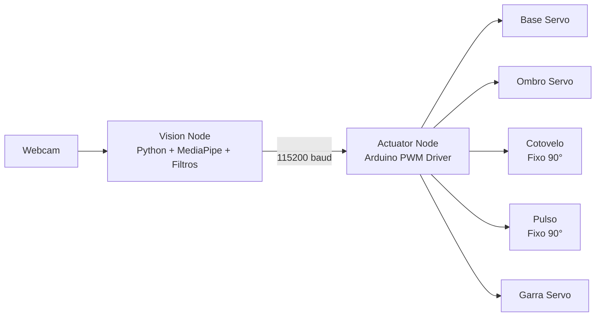

# Adeept MVP: Optical Gesture Controller

## Foto do Braço


## Vídeo de Demonstração

Cola aqui o link do YouTube:

[Ver vídeo de demonstração](https://youtube.com/shorts/uPPbhAjYep4?feature=share)

## Visão Geral

Sistema de controlo híbrido que traduz landmarks da mão detetados por visão computacional (MediaPipe) em comandos angulares para o braço robótico Adeept. Este projeto opera intencionalmente como um MVP de 3-DOF ativo (Base, Ombro, Garra). Os eixos do Cotovelo e do Pulso estão fixados por software a 90° para preservar a integridade estrutural do chassis de acrílico e reduzir a carga mecânica e elétrica durante o movimento.

## Arquitetura



## Pipeline de Processamento

O sistema processa landmarks da mão em tempo real e aplica salvaguardas cinéticas antes de enviar comandos ao hardware:

### Clamping Absoluto
As funções de mapeamento fazem clamp dos valores de entrada antes da interpolação linear. Isto garante que cada comando enviado para os servos respeita os limites definidos no software.

### Filtro Cinético (EMA)
Aplicação de uma Média Móvel Exponencial (Alpha = 0.15) sobre os vetores alvo. O objetivo é suavizar a transição entre estados e evitar arranques mecânicos bruscos.

### Deadband
Zona morta de 3° que ignora variações pequenas face ao último valor enviado. Isso reduz jitter de visão e evita comandos redundantes.

### Rate Limiting
A escrita na porta série é limitada a 15 Hz para evitar saturação do buffer de receção do microcontrolador.

## Hardware e Pinagem

| Eixo (Servo) | Pino | Estado no Sistema |
|---|---|---|
| Base | D9 | Ativo (Translação X da Mão) |
| Ombro | D6 | Ativo (Translação Y da Mão) |
| Cotovelo | D5 | Bloqueado (90°) |
| Pulso | D3 | Bloqueado (90°) |
| Garra | D11 | Ativo (Distância Polegar-Indicador) |

## Protocolo de Potência (CRÍTICO)

⚠️ **A alimentação dos servos por baterias 18650 deve estar separada da alimentação USB do computador.** No uso normal, o USB continua ligado para comunicação serial com o nó de visão e, se necessário, para a lógica do Arduino; as baterias alimentam o rail dos servos. O ponto crítico é não tentar extrair a corrente dos motores do USB do Mac.

### Sequência Correta de Inicialização

1. Carregar o firmware via USB
2. Ligar as baterias para alimentar os servos
3. Manter o USB ligado para comunicação e telemetria de dados
4. Iniciar o Nó de Visão

## Execução

### Firmware (C++)

Fazer upload de `AdeeptFirmware.ino` (115200 baud).

### Vision Node (Python/macOS)

```bash
python -m venv venv
source venv/bin/activate
pip install -r requirements.txt
./venv/bin/python hand_gesture_arm_controller.py
```

**Nota:** Ajustar `SERIAL_PORT` no código para o path correto do dispositivo no macOS (ex: `/dev/cu.usbserial-140`).

## Requisitos

- Python 3.9.6 (testado)
- opencv-python
- mediapipe
- pyserial
- Mac M1/M2/M3/M4 (testado em M4 Air)

## Ficheiros Principais

- `hand_gesture_arm_controller.py` - Nó de Visão (deteção de mão e mapeamento para ângulos)
- `AdeeptFirmware.ino` - Firmware do Arduino (Servo.h, serial communication)
- `requirements.txt` - Dependências Python

## Limitações e Notas

- MVP intencionalmente limitado a 3-DOF ativos
- Cotovelo e Pulso fixos a 90° por decisão de projeto mecânico e elétrico
- Deadband de 3° para evitar enviar comandos quando a diferença face ao último valor enviado é pequena
- Rate limiting a 15 Hz para proteger a receção serial do Arduino
- Alimentação dos servos separada da alimentação USB